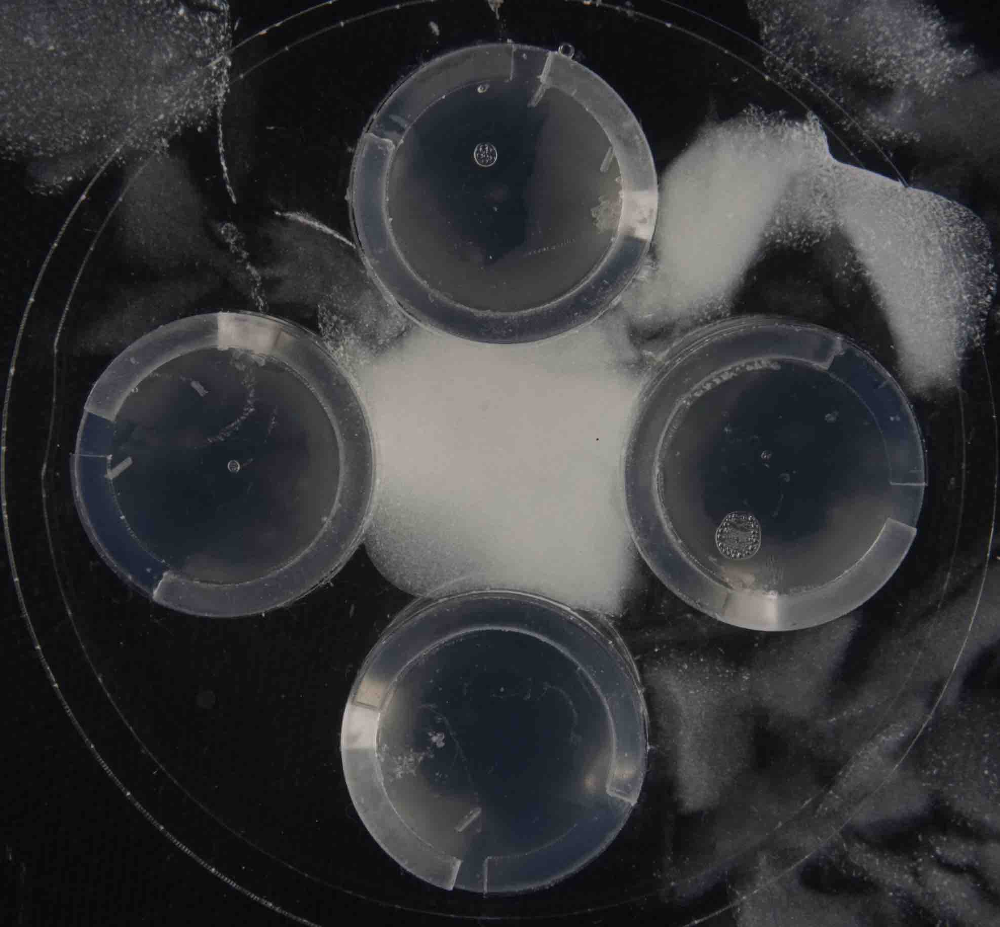
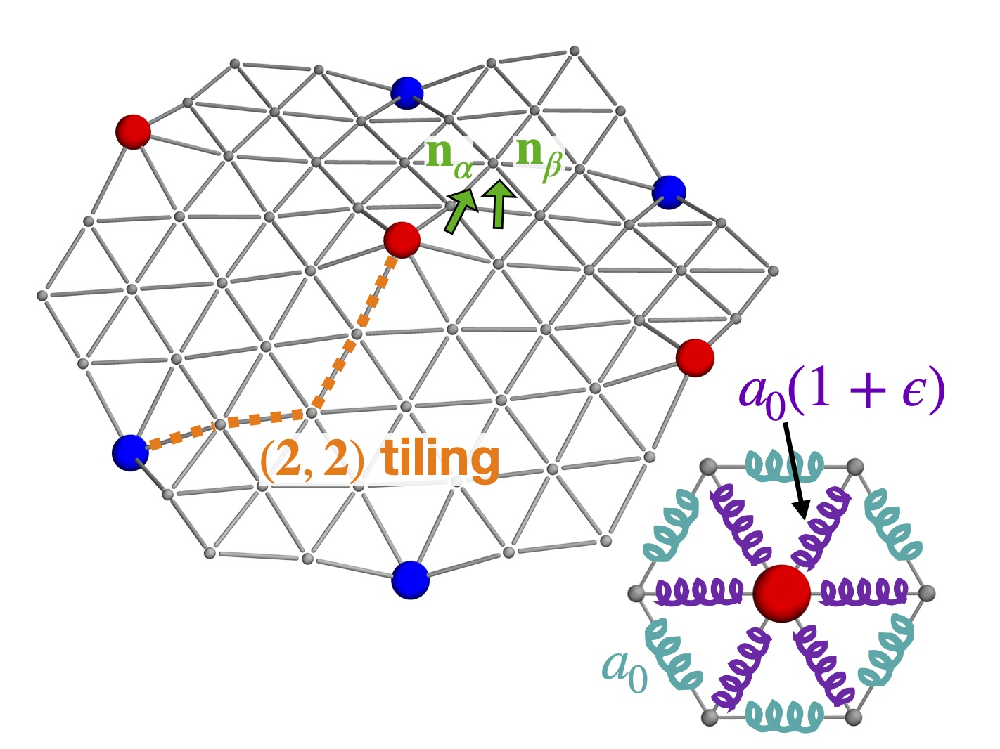
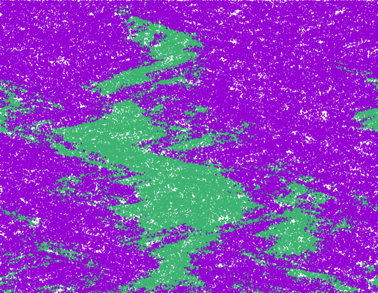
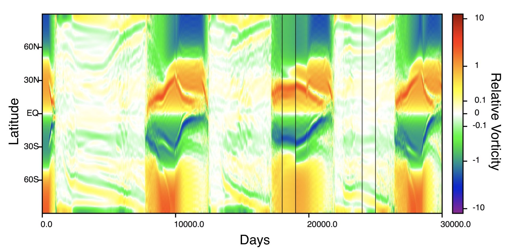

## Research projects

### Obstructed swelling and fracture in hydrogels

Collaborators: <a href="https://www.princeton.edu/~akosmrlj/" target="_blank">Andrej Košmrlj</a>, <a href="https://dattalab.princeton.edu/" target="_blank">Sujit Datta </a>, <a href="https://we3lab.stanford.edu/people/caroline-adkins" target="_blank">Caroline Adkins</a>, and <a href="https://www.nifelab.com/team" target="_blank">Jean-François Louf</a>.  Understanding how expanding or growing bodies respond to the presence of obstacles is relevant to many fields, including medicine, morphogenesis, and agriculture. We use hydrogels, polymer networks that expand in water, to explore how stresses develop in this general scenario. As pictured at right, we identify a regime in which stresses due to obstacles cause swelling hydrogels to fracture, tearing themselves apart as they expand. 

### Buckling and phase transitions in dilation arrays

Collaborators: <a href="https://www.physics.harvard.edu/people/facpages/nelson" target="_blank">David Nelson</a>, <a href="https://phanakata.github.io/" target="_blank">Paul Hanakata</a>.  We studied a periodic array of dilational impurities embedded in a crystalline membrane. Past a buckling transition, these dilations become bistable and behave like Ising spins. At finite temperature, we can observe critical phenomena and an anomalous thermal expansion. See our papers for details on the zero temperature (<a href="https://doi.org/10.1103/PhysRevE.102.033002" target="_blank"><u>doi</u></a>, <a href="https://arxiv.org/abs/2002.12302" target="_blank"><u>arXiv</u></a>) and finite temperature behavior of the model (<a href="https://doi.org/10.1103/PhysRevLett.128.075902" target="_blank"><u>doi</u></a>, <a href="https://arxiv.org/abs/2105.10015" target="_blank"><u>arXiv</u></a>), and how curvature acts as an effective external field (<a href="https://doi.org/10.1103/PhysRevMaterials.6.115203" target="_blank"><u>doi</u></a>, <a href="https://arxiv.org/abs/2208.01085" target="_blank"><u>arXiv</u></a>).  

### Competing species in a turbulent fluid

Collaborators: <a href="https://scholar.google.com/citations?user=QJeFmVEAAAAJ&hl=en" target="_blank">Roberto Benzi</a>, <a href="https://www.physics.harvard.edu/people/facpages/nelson" target="_blank">David Nelson</a>, <a href="http://toschi.phys.tue.nl/wordpress/" target="_blank">Federico Toschi</a>, <a href="https://scholar.google.it/citations?user=Gh8Jv_MAAAAJ&hl=it" target="_blank">Giorgia Guccione</a>, <a href="https://mara-freilich.github.io/" target="_blank">Mara Freilich</a>, <a href="https://mahadevan.whoi.edu/" target="_blank">Amala Mahadevan</a>, and <a href="https://www.geomar.de/en/azworden" target="_blank">Alexandra Worden</a>. 
In marine environments, phytoplankton may compete with one another while being advected by effectively compressible turbulent flows. Working in one dimension, we found that even very weak divergence can affect fixation probabilities (<a href="https://doi.org/10.1073/pnas.1812829116" target="_blank"><u>doi</u></a>, <a href="https://arxiv.org/abs/1808.07128" target="_blank"><u>arXiv</u></a>, <a href="http://physics.bu.edu/theory-living-systems/meetings/2019.html" target="_blank"><u>video</u></a>). We later replicated some of these results in simple two-dimensional flows (<a href="https://doi.org/10.1103/PhysRevE.100.062105" target="_blank"><u>doi</u></a>, <a href="https://arxiv.org/abs/1907.09377" target="_blank"><u>arXiv</u></a>). In a recent <a href="https://arxiv.org/abs/2202.11745" target="_blank"><u>preprint</u></a>, we adapted these ideas to ecological time scales, and combined observations, simulations, and theory to understand the impact of effective compressibility in realistic oceanic scenarios.

### Instability in a differentially rotating plasma 

Collaborators: <a href="https://www.brown.edu/Research/bradmarston/Professor_Marston/Welcome.html" target="_blank">Brad Marston</a>, <a href="http://www1.maths.leeds.ac.uk/~smt/" target="_blank">Steve Tobias</a>. A tachocline is a thin shear layer thought to play an important role in the magnetic activity of Sun-like stars. We studied an idealized two-dimensional model of the solar tachocline, focusing on a joint instability in which the model's differential rotation is stable in the absence of a magnetic field but unstable in its presence. 
See our paper for details (<a href="https://doi.org/10.1017/S0022377819000060" target="_blank"><u>doi</u></a>, <a href="https://arxiv.org/abs/1809.00921" target="_blank"><u>arXiv</u></a>).
